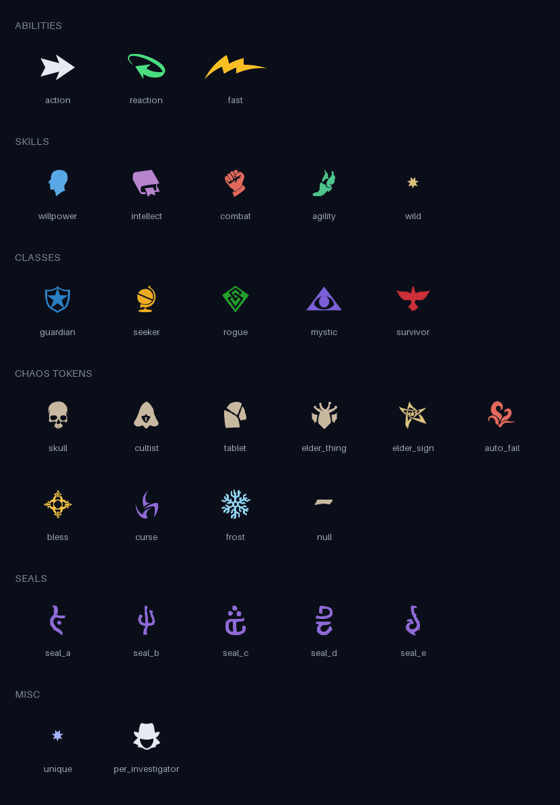

# Arkham icon index

Every icon ArkhamDB's `app.css` can render, where it comes from, and how to use it here.



## Where the icons actually live

ArkhamDB ships **one icon font**, `bundles/app/fonts/arkham-icons.otf` (`@font-face`
family `thronesdb`, generated by IcoMoon). There is no image per icon upstream — the
`.icon-*` classes are `:before` rules that print a single ASCII character in that font:

```css
[class^="icon-"],[class*=" icon-"]{font-family:'thronesdb'; …}
.icon-willpower:before{content:"p"}
```

The one exception is the five class symbols. ArkhamDB draws those from 16×16 PNGs
(`bundles/app/images/factions/<faction>.png`) even though the font contains them too.

### What this project stores

| Path | What |
|---|---|
| `fonts/arkham-icons.{woff,ttf,otf}` | the icon font, unmodified |
| `img/icons/<name>.svg` | every glyph extracted to a standalone SVG (`fill="currentColor"`, 1024-unit em box), plus the two hand-added drawings below |
| `img/factions/<faction>.png` | ArkhamDB's own 16px class plates, as shipped (kept for reference — the UI uses the font) |
| `css/arkham-icons.css` | `@font-face` + the `.icon-*` / `.color-*` classes |

## The map

Character = the literal character to print in `arkham-icons`. "app.css" = the class name
ArkhamDB uses; aliases in parentheses.

### Abilities

| Icon | Char | app.css class | SVG |
|---|---|---|---|
| Action | `i` | `.icon-action` | `img/icons/action.svg` |
| Reaction | `!` | `.icon-reaction` | `img/icons/reaction.svg` |
| Fast / free | `j` | `.icon-fast` (`.icon-free`, `.icon-lightning`) | `img/icons/fast.svg` |

### Skills

| Icon | Char | app.css class | SVG |
|---|---|---|---|
| Willpower | `p` | `.icon-willpower` (`.icon-will`) | `img/icons/willpower.svg` |
| Intellect | `b` | `.icon-intellect` (`.icon-lore`) | `img/icons/intellect.svg` |
| Combat | `c` | `.icon-combat` (`.icon-strength`) | `img/icons/combat.svg` |
| Agility | `a` | `.icon-agility` | `img/icons/agility.svg` |
| Wild | `s` | `.icon-wild` | `img/icons/wild.svg` |

**Wild is the one deliberate deviation from `app.css`.** Upstream sets
`.icon-wild:before{content:"?"}` — a character the font has no glyph for, so ArkhamDB
renders a literal question mark. The font ships exactly one star (`s`, also used for
`.icon-unique`), which is the printed wild icon, so this project uses it. The two never
appear in the same place: unique only prefixes a card title, wild only appears in skill
rows and card text.

### Classes / factions

Not referenced by `app.css` — ArkhamDB uses the PNGs — but the characters are in the font.
They were identified by matching each glyph against the class symbol printed on the
core-set investigator cards `01001`–`01005`.

| Icon | Char | Class here | Assets |
|---|---|---|---|
| Guardian (shield + star) | `f` | `.icon-guardian` | `img/icons/guardian.svg`, `img/factions/guardian.png` |
| Seeker (globe) | `h` | `.icon-seeker` | `img/icons/seeker.svg`, `img/factions/seeker.png` |
| Rogue (diamond + serpent) | `d` | `.icon-rogue` | `img/icons/rogue.svg`, `img/factions/rogue.png` |
| Mystic (eye in triangle) | `g` | `.icon-mystic` | `img/icons/mystic.svg`, `img/factions/mystic.png` |
| Survivor (bird) | `e` | `.icon-survivor` | `img/icons/survivor.svg`, `img/factions/survivor.png` |

Neutral and Mythos have neither a glyph nor a PNG; the UI falls back to a coloured dot.

### Chaos bag tokens

| Icon | Char | app.css class | SVG |
|---|---|---|---|
| Skull | `k` | `.icon-skull` | `img/icons/skull.svg` |
| Cultist | `l` | `.icon-cultist` | `img/icons/cultist.svg` |
| Tablet | `q` | `.icon-tablet` | `img/icons/tablet.svg` |
| Elder Thing | `n` | `.icon-elder_thing` | `img/icons/elder_thing.svg` |
| Elder Sign | `o` | `.icon-elder_sign` (`.icon-eldersign`) | `img/icons/elder_sign.svg` |
| Auto-fail | `m` | `.icon-auto_fail` | `img/icons/auto_fail.svg` |
| Bless | `v` | `.icon-bless` | `img/icons/bless.svg` |
| Curse | `w` | `.icon-curse` | `img/icons/curse.svg` |
| Frost | `x` | `.icon-frost` | `img/icons/frost.svg` |
| Null | `t` | `.icon-null` | `img/icons/null.svg` |

### Seals (The Circle Undone)

| Icon | Char | app.css class | SVG |
|---|---|---|---|
| Seal A | `1` | `.icon-seal_a` | `img/icons/seal_a.svg` |
| Seal B | `2` | `.icon-seal_b` | `img/icons/seal_b.svg` |
| Seal C | `3` | `.icon-seal_c` | `img/icons/seal_c.svg` |
| Seal D | `4` | `.icon-seal_d` | `img/icons/seal_d.svg` |
| Seal E | `5` | `.icon-seal_e` | `img/icons/seal_e.svg` |

Upstream `app.css` has `.icon-seal_b:before{content:"=2"}` — a typo that prints a stray
`=`. Fixed to `"2"` here.

### Misc

| Icon | Char | app.css class | SVG |
|---|---|---|---|
| Unique | `s` | `.icon-unique` | `img/icons/unique.svg` |
| Per investigator | `u` | `.icon-per_investigator` | `img/icons/per_investigator.svg` |

Every glyph in the font is accounted for above — nothing is left unmapped.

### Not in the font

Health and sanity have no glyph upstream, so the drawings are kept as files and painted
as a CSS mask tinted with `currentColor` — the sources are solid black, not
`currentColor`, so they cannot be dropped in as an `` and still follow the palette.
`docs/regen-icons.py` only writes the names it knows about, so it leaves these alone.

| Icon | class | SVG |
|---|---|---|
| Health | `.ah-svg.ah-svg-health` (`.color-health`) | `img/icons/health.svg` |
| Sanity | `.ah-svg.ah-svg-sanity` (`.color-sanity`) | `img/icons/sanity.svg` |

The mask classes live in `css/style.css`, not `css/arkham-icons.css`, which stays a
mirror of upstream. `Markup.iconHtml('health', …)` and the `[health]` / `[sanity]` tokens
pick them up automatically — nothing at the call site changes.

## Using them

```html
<span class="icon-willpower color-willpower" role="img" aria-label="Willpower"></span>
<span class="icon-guardian icon-large"></span>
```

Modifiers from `css/arkham-icons.css`:

- size — `.icon-large` (1.35em), `.icon-big` (1.9em); otherwise the glyph inherits `font-size`
- colour — `.color-willpower|intellect|combat|agility|wild`,
  `.color-guardian|seeker|rogue|mystic|survivor|neutral|mythos`,
  `.color-action|reaction|fast|token|bless|curse|frost|unique`

From JS, `Markup.iconHtml(name, colour, label, extraClass)` builds the span, and
`Markup.hasFactionIcon(code)` reports whether a faction has a glyph.

Card text coming back from the API keeps its `[token]` markup; `Markup.renderText` /
`renderInline` swap each token for the matching span, so `[reaction]`, `[willpower]`,
`[per_investigator]` and friends render as real icons with no extra work.

## Where they show up

- card text, flavour text and reverse-side text (via `Markup.renderText`)
- the "Icons" line on the card detail page — one pip per skill with a `×N` count, rather
  than the glyph repeated once per printed copy
- the stat tiles — Willpower / Intellect / Combat / Agility / Health / Sanity, and the
  enemy and location stats that reuse those kinds (Fight, Evade, Shroud, Clues, Damage,
  Horror)
- the class symbol on every grid tile, on the faction filter chips, and on the faction
  badge in the card header
- the unique marker before a card's name

## Regenerating

`docs/regen-icons.py` re-downloads `app.css` and the font from ArkhamDB, re-extracts every
glyph to `img/icons/`, and refreshes `fonts/` and `img/factions/`.
